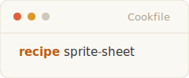
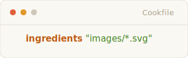
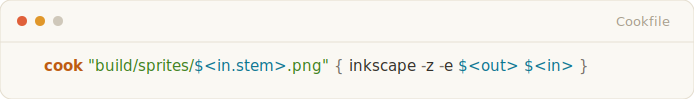
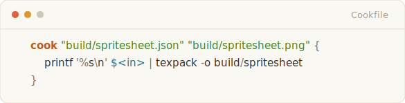

<p align="center">
  <picture>
    <source media="(prefers-color-scheme: dark)" srcset="assets/readme/logo-dark.svg">
    
  </picture>
</p>

<p align="center"><b>Build artifacts just like grandma used to make.</b></p>

Got a lot of chefs complicating your build pipeline: cargo, CMake, pnpm, a
`scripts/` directory nobody will admit to writing? cook brings a kitchen with 
enough heat to keep the whole crew moving in sync.

cook is a declarative language and execution model for building software: one
dependency graph where all of those chefs cook side by side. It takes the
friendly recipe ergonomics of [`just`](https://github.com/casey/just), keeps
the dependency graph of [`make`](https://www.gnu.org/software/make/), swaps macro-heavy configuration 
for a Lua-backed declarative DSL, giving you an escape hatch to imperative scripting when 
your pipelines call for it. You describe artifacts in a
`Cookfile`; cook turns those declarations into a unified dependency graph and runs only the
parts whose inputs changed.

Heard enough?

```sh
curl -fsSL https://getcook.sh | sh
```

Still curious? Keep reading.

## Let's cook

Say you're handed a pile of SVGs and you need to bake a PNG sprite sheet.

<picture>
  <source media="(prefers-color-scheme: dark)" srcset="assets/readme/snippet-sprite-dark.svg">
  
</picture>

In five lines of cook we have a parallel asset pipeline with content-addressed
caching and incremental execution.

<picture>
  <source media="(prefers-color-scheme: dark)" srcset="assets/readme/snippet-run-dark.svg">
  
</picture>

Let's break the recipe down.

### 1. Naming the dish

<picture>
  <source media="(prefers-color-scheme: dark)" srcset="assets/readme/snippet-name-dark.svg">
  
</picture>

Every recipe needs a name so the kitchen knows what it's preparing. `cook
sprite-sheet` tells the engine to look at this instruction card.

### 2. Sourcing the pantry

<picture>
  <source media="(prefers-color-scheme: dark)" srcset="assets/readme/snippet-ingredients-dark.svg">
  
</picture>

cook gathers the raw ingredients and hashes their contents.

### 3. The prep work (the fan-out)

<picture>
  <source media="(prefers-color-scheme: dark)" srcset="assets/readme/snippet-prep-dark.svg">
  
</picture>

A `cook` step starts by declaring its target. Ours contains the `$<in.stem>`
shape: `in` is the *in*coming ingredient, `stem` is its filename's stem.
Because the target is different for every input, cook infers one independent
unit of work per SVG. Fifty SVGs? Fifty parallelizable jobs spread across your
cores, each with `$<in>` and `$<out>` resolved to its own file.

### 4. The bake (the aggregation)

<picture>
  <source media="(prefers-color-scheme: dark)" srcset="assets/readme/snippet-bake-dark.svg">
  
</picture>

Notice `$<in.stem>` is missing from these targets. Static, uniform outputs
tell cook this step *gathers*: it waits for every upstream PNG from the prep
step, then fires exactly once. Because texpack expects a 
newline-separated list of files on standard input, we use printf to format 
our incoming list of prepped files ($<in>) and pipe them directly into the tool.

That's the core inference. An accessor in the target means fan out; no
accessor means gather. You never write the loop or the join. The shape of your
outputs tells cook the shape of the work, and every step is cached on its own,
so the pipeline stays incremental at every stage.


## Still hungry?

Good. The sprite sheet was the appetizer. What follows are the design choices that make cook more than another task runner.

### No mystery misses

Every build tool promises caching. Almost none of them can tell you why you
got a miss, and if you've run a content-addressed build at scale, you've lost
an afternoon to exactly that. cook treats an unexplainable miss as a bug in
the tool. `cook why` prints every determinant behind every unit's key with
its hit or miss status, and on a shared-store miss it diffs your key against
what the cached artifact was actually built from. `cook cache verify` re-runs
cached work and reports byte divergence, which is how you catch an input you
forgot to declare.

### The key is what you declared, nothing else

cook does not quietly fold your machine, locale, or toolchain into every key.
That keeps artifacts portable by default, and it makes *you* responsible for
naming your real determinants. When the compiler matters, say so:

<picture>
  <source media="(prefers-color-scheme: dark)" srcset="assets/readme/snippet-seal-dark.svg">
  
</picture>

`seal` folds the resolved compiler identity into each unit's key. The local
cache and the shared store are addressed by that same key, so a teammate or a
CI runner reuses your artifact exactly when they'd have computed the same one.
Even intrinsically non-reproducible work (an LLM response, say) has a
disposition that says so: `nondet` records it once and reuses the recording
rather than pretending the bytes are deterministic.

### Data can shape the build

Globs are only one source of fan-out. A **probe** is a named, cached value
the graph can see, and recipes can iterate it:

<picture>
  <source media="(prefers-color-scheme: dark)" srcset="assets/readme/snippet-probe-dark.svg">
  
</picture>

If `services.json` holds an array of records, `configs` runs once per record.
Add a service and exactly one new unit builds; remove one and cook sweeps its
orphaned output. This is the shape behind eval suites, per-package monorepo
tasks, and any build that's really "one job per row of some data."

### Recipes build; chores do

Deploying, cleaning, and opening interactive tools don't produce reproducible
artifacts, so they don't belong in recipes. They're **chores**, and chores
deliberately run every time, with a real TTY and real parameters:

<picture>
  <source media="(prefers-color-scheme: dark)" srcset="assets/readme/snippet-chore-dark.svg">
  
</picture>

```console
$ cook deploy staging
```

The assets stay cached; the deployment doesn't. This split is the one thing to
unlearn if you're coming from `make` or npm scripts: a recipe body is a plan,
not a place for run-every-time shell.

### Lua when shell isn't enough

Need imperative scripting? Here it is. A `>{ ... }` body runs Lua
instead of shell commands, with the unit's resolved I/O in scope:

<picture>
  <source media="(prefers-color-scheme: dark)" srcset="assets/readme/snippet-lua-dark.svg">
  
</picture>

Most of cook's surface language is syntax sugar. Every Cookfile is lowered to Lua before execution, and `cook emit-lua` shows you exactly what yours compiles to.

Underneath is a Lua interface backed by cook's runtime. Modules distributed through LuaRocks use that interface to teach cook about entire ecosystems.

For example, cook_cc provides helpers for C and C++ projects, allowing them to participate in the same dependency graph as the rest of your codebase.

## At scale

Two repository-sized builds, using nothing but the pieces above. Same recipes,
same ingredients, same probes and modules, no special modes.

- [**cook-dogfood**](https://github.com/LioraLabs/cook-dogfood): a polyglot
  monorepo. A .NET API, a TypeScript/pnpm web app, a Rust CLI, and generated
  cross-language contracts, built as one graph. Each subtree owns its
  Cookfile, `import` joins them.

- [**dhewm3**](https://github.com/LioraLabs/dhewm3): the Doom 3 source port, built with `cook_cc` as a 427-node dependency graph.

## Install and try it

cook is a single Rust binary with a bundled Lua 5.4 and LuaRocks. No system
Lua to match, no package manager to fight. Linux and macOS get the one-liner
from the top of this page:

```sh
curl -fsSL https://getcook.sh | sh
```

Or from source:

```sh
cargo install --locked --git https://github.com/LioraLabs/cook cook-cli
```

Then:

```sh
mkdir hello-cook && cd hello-cook
cook init
cook
```

## Keep exploring

- [**The Cook Manual**](document.md): the complete, read-top-to-bottom guide.
- [**Examples**](examples/): runnable, arranged in learning order.
- [**The Cook Standard**](standard/): the authoritative specification.
- [**Sharing a cache across a team**](docs/shared-cache.md): the shared store is
  a directory — point everyone at one path, no server to run.

cook is pre-1.0 software. If this friendly tour and the Standard disagree, the
Standard wins, and the README has a bug.
