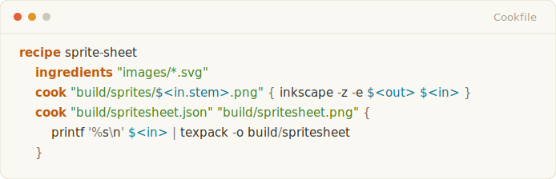
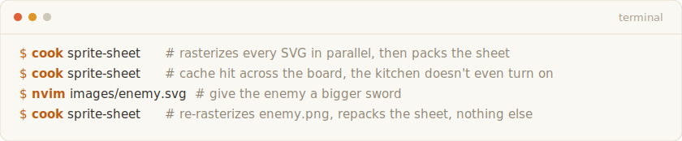
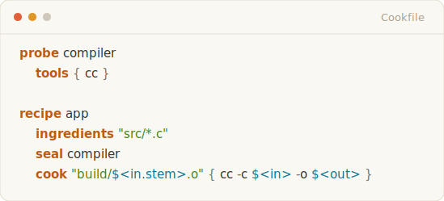
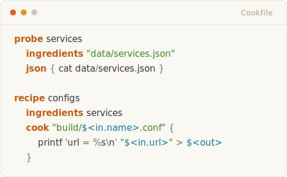
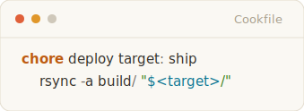
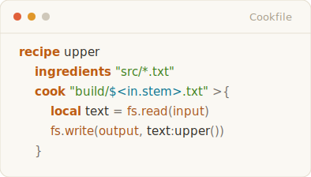

<!-- GENERATED FILE: README.md is compiled from README.source (`cook readme`).
     Edit README.source; code snippets live there as ```cook fences. -->
<p align="center">
  <picture>
    <source media="(prefers-color-scheme: dark)" srcset="assets/readme/logo-dark.svg">
    
  </picture>
</p>

<p align="center"><b>Build artifacts just like grandma used to make.</b></p>

<p align="center">
  <a href="https://github.com/LioraLabs/cook/actions/workflows/ci.yml"></a>
  <a href="https://github.com/LioraLabs/cook/releases/latest"></a>
  <a href="document.md"></a>
  <a href="LICENSE"></a>
</p>

cook is a declarative language and execution model for building software:
cargo, CMake, pnpm, codegen, and asset pipelines in one dependency graph with
one content-addressed cache. It keeps the recipe ergonomics of
[`just`](https://github.com/casey/just) and the dependency graph of
[`make`](https://www.gnu.org/software/make/), and swaps macro-heavy
configuration for a declarative DSL that lowers to Lua. You describe artifacts
in a `Cookfile`; cook runs exactly the work whose inputs changed.

```sh
curl -fsSL https://getcook.sh | sh
```

## Let's cook

Say you're handed a pile of SVGs and you need a PNG sprite sheet.

<picture>
  <source media="(prefers-color-scheme: dark)" srcset="assets/readme/snippet-sprite-dark.svg">
  
</picture>

Five lines: a parallel asset pipeline with content-addressed caching and
incremental execution.

<picture>
  <source media="(prefers-color-scheme: dark)" srcset="assets/readme/snippet-run-dark.svg">
  
</picture>

The inference lives in the targets. `$<in.stem>` varies per input, so the
first step fans out: one independent unit of work per SVG, parallel across
your cores, each cached under its own key. The second step's targets are
static, so it gathers: it waits for every upstream PNG and fires exactly once.
An accessor in the target means fan out; no accessor means gather. You never
write the loop or the join, and the pipeline stays incremental at every stage.

Every idea on this page is covered in depth in [the manual](document.md) and
demonstrated by the runnable projects in [`examples/`](examples/).

## What makes cook different

### No mystery misses

Every build tool promises caching; almost none can tell you why you got a
miss. cook treats an unexplainable miss as a bug in the tool. `cook why`
prints every determinant behind every unit's key with its hit or miss status,
and on a shared-store miss it diffs your key against what the cached artifact
was actually built from. `cook cache verify` re-runs cached work and reports
byte divergence — how you catch an input you forgot to declare.

### The key is what you declared, nothing else

cook does not quietly fold your machine, locale, or toolchain into every key.
That keeps artifacts portable by default, and it makes *you* responsible for
naming your real determinants. When the compiler matters, say so:

<picture>
  <source media="(prefers-color-scheme: dark)" srcset="assets/readme/snippet-seal-dark.svg">
  
</picture>

`seal` folds the resolved compiler identity into each unit's key. The local
cache and the shared store are addressed by that same key, so a teammate or a
CI runner reuses your artifact exactly when they'd have computed the same one.
Intrinsically non-reproducible work (an LLM response, say) declares that too:
`nondet` records it once and reuses the recording rather than pretending the
bytes are deterministic.

### Data can shape the build

Globs are only one source of fan-out. A **probe** is a named, cached value
the graph can see, and recipes can iterate it:

<picture>
  <source media="(prefers-color-scheme: dark)" srcset="assets/readme/snippet-probe-dark.svg">
  
</picture>

If `services.json` holds an array of records, `configs` runs once per record.
Add a service and exactly one new unit builds; remove one and cook sweeps its
orphaned output. This is the shape behind eval suites, per-package monorepo
tasks, and any build that's really "one job per row of some data."

### Recipes build; chores do

Deploying, cleaning, and opening interactive tools don't produce reproducible
artifacts, so they don't belong in recipes. They're **chores**, and chores
deliberately run every time, with a real TTY and real parameters:

<picture>
  <source media="(prefers-color-scheme: dark)" srcset="assets/readme/snippet-chore-dark.svg">
  
</picture>

```console
$ cook deploy staging
```

The assets stay cached; the deployment doesn't. A recipe body is a plan, not
a place for run-every-time shell.

### Lua when shell isn't enough

A `>{ ... }` body runs Lua instead of shell, with the unit's resolved I/O in
scope:

<picture>
  <source media="(prefers-color-scheme: dark)" srcset="assets/readme/snippet-lua-dark.svg">
  
</picture>

This is not an embedded afterthought: every Cookfile is lowered to Lua before
execution (`cook emit-lua` shows you exactly what yours compiles to), and
modules distributed through LuaRocks use the same interface to teach cook
about entire ecosystems — `cook_cc` brings C and C++ projects into the same
dependency graph as the rest of your codebase.

## At scale

Two repository-sized builds, using nothing but the pieces above. Same
recipes, same ingredients, same probes and modules, no special modes.

- [**cook-dogfood**](https://github.com/LioraLabs/cook-dogfood): a polyglot
  monorepo. A .NET API, a TypeScript/pnpm web app, a Rust CLI, and generated
  cross-language contracts, built as one graph. Each subtree owns its
  Cookfile, `import` joins them.

- [**dhewm3**](https://github.com/LioraLabs/cook-dhewm3): the Doom 3 source
  port, built with `cook_cc` as a 427-node dependency graph.

## Install

The one-liner at the top of this page installs a single Rust binary with
Lua 5.4 and LuaRocks bundled — no system Lua to match, no package manager to
fight (Linux and macOS). Or build from source:

```sh
cargo install --locked --git https://github.com/LioraLabs/cook cook-cli
```

Then:

```sh
mkdir hello-cook && cd hello-cook
cook init
cook
```

## Learn cook

- [**The Cook Manual**](document.md) — the complete, read-top-to-bottom guide.
- [**Examples**](examples/) — runnable, arranged in learning order.
- [**The Cook Standard**](standard/) — the authoritative specification.
- [**Sharing a cache across a team**](docs/shared-cache.md) — the shared store
  is a directory; point everyone at one path, no server to run.

## Chef's note

This README is itself a cook build: a probe reads
[`README.source`](README.source) for the code snippets, a recipe fans out one
light-and-dark render per snippet, and a gather step compiles the page. Edit
one snippet and only its pair re-bakes. The recipe is at the bottom of the
[`Cookfile`](Cookfile).

cook is pre-1.0 software. If this friendly tour and the Standard disagree,
the Standard wins, and the README has a bug.

## License

Apache-2.0. See [LICENSE](LICENSE).
